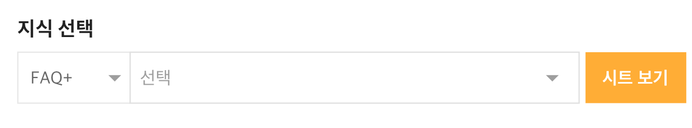
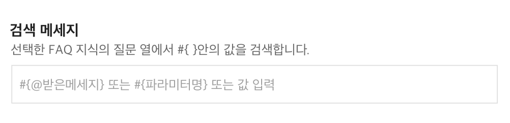
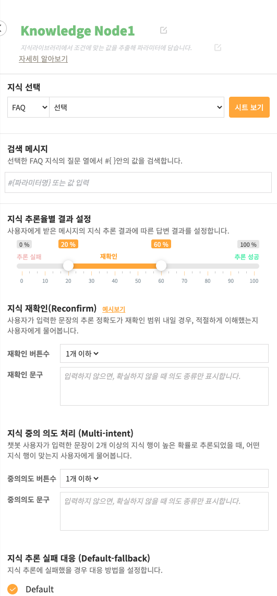



## 개요

Knowledge Node의 행추가 기능은 지식라이브러리의 Sheet지식에 새로운 행을 추가할때 사용됩니다. 행을 추가하고 그 처리 값을 특정 파라미터로 전달합니다.

## 사용법
<ol>
    <li>
        
Knowledge 노드를 Slot>Knowledge>Speak 등과 연결하여 사용하시면 됩니다.

        
    </li>
    <li>
        
Knowolege 노드를 더블클릭하여 패널을 엽니다.

    </li>
    <li>
        
FAQ 또는 FAQ+ 지식 타입을 선택하고 만든 지식을 선택합니다.

        
    </li>
    <li>
        
사용자에게 받을 메세지 파라미터를 설정합니다.#{파라미터명}으로 특정 파라미터를 지정해주시거나 #{@받은메세지}로 바로 전에 남긴 메세지로 값을 지정해줄 수 있습니다.
        
        
    </li>
    <li>
        
받은 메세지의 지식 추론율별로 내보낼 메세지를 설정합니다.

        
    </li>
</ol>


