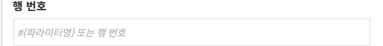
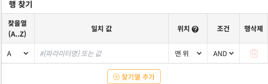
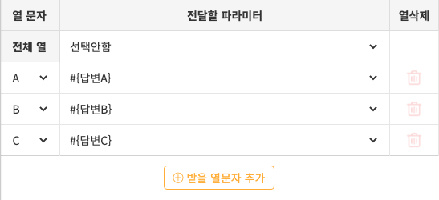
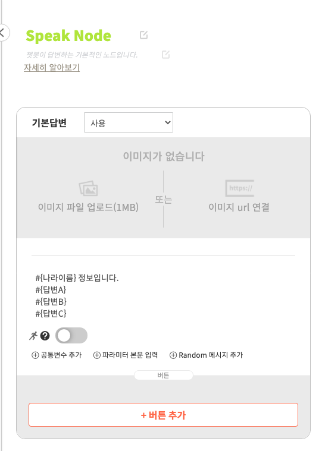



Knowledge 노드는 단비의 <a href="knowledge_library.html">지식라이브러리</a>에서 Sheet지식 데이터를 불러담는데에 사용됩니다. 사용자에게 받은 파라미터의 값에 따라 행을 조회하고, 해당 행 중 특정 열의 값을 파라미터에 담을 수 있습니다.

### 사용법

<ol>
    <li>
        
Knowledge 노드를 Slot>Knowledge>Speak 등과 연결하여 사용하시면 됩니다.

        
    </li>
    <li>
        
Knowolege 노드를 더블클릭하여 패널을 엽니다.

    </li>
    <li>
        
지식을 선택합니다. Sheet 지식 중에서 선택이 가능합니다.

        
    </li>
    <li>
        
조회할 행을 찾는 방법을 먼저 선택합니다.

        <table class="table table-bordered">
            <thead>
                <tr class="header">
                    <th>행 번호로 찾기</th>
                    <th>행 키워드로 찾기</th>
                </tr>
            </thead>
            <tbody>
                <tr>
                    <td>사용자에게 직접 행 번호값을 입력받아서 찾는 방법입니다.</td>
                    <td>사용자가 입력한 값이 들어있는 행을 찾는 방법입니다.</td>
                </tr>
                <tr>
                    <td></td>
                    <td></td>
                </tr>
            </tbody>
        </table>
    </li>
    <li>
        
조회한 행을 특정 파라미터에 담아두는 과정을 설정해둡니다. 사용자의 입력 값에 따라 나온 행 중 특정 열의 값을 해당 파라미터에 담도록 합니다.

        
    </li>
    <li>
        
이제 Speak, Carousel, Slot 노드 등에 해당 #{파라미터명}를 입력하시면 사용자의 요청 값에 따라 지식라이브러리를 조회하여 답변을 내보낼 수 있습니다.

        
    </li>
</ol>


