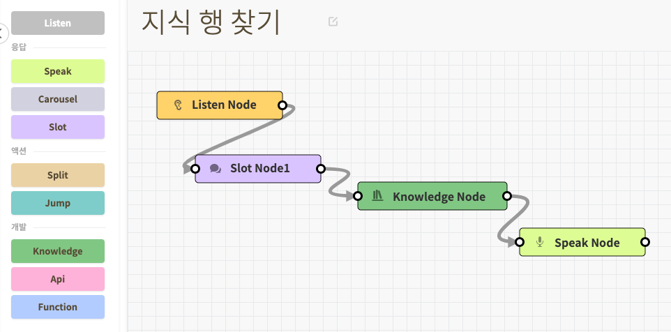



## 개요

Knowledge Node의 행추가 기능은 지식라이브러리의 Sheet지식에 새로운 행을 추가할때 사용됩니다. 행을 추가하고 그 처리 값을 특정 파라미터로 전달합니다.

## 사용법
<ol>
    <li>
        
Knowledge 노드를 Slot>Knowledge>Speak 등과 연결하여 사용하시면 됩니다.

        
    </li>
    <li>
        
Knowledge Node를 더블클릭하여 패널을 엽니다.

    </li>
    <li>
        
sheet 지식 타입을 선택하고 만든 지식을 선택합니다.

        
    </li>
    <li>
        
행 추가 탭을 선택하고 맨 아래 추가될 행의 값을 열별로 세팅합니다.
        
    </li>
    <li>
        
또한 행 추가 처리 결과에 대한 값을 파라미터에 넣어 전달할 수 있습니다.
        
    </li>
</ol>


